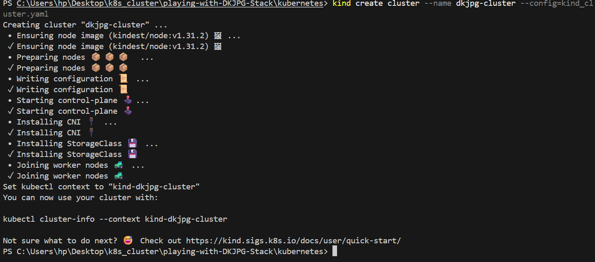

# K8s(Kubenetes)
This repository contains Kubernetes manifests and configuration files for deploying and managing the DKJPG stack. It provides resources for setting up, scaling, and maintaining the stack components within a Kubernetes cluster. Use these files as a reference or starting point for your own deployments.

## Setup kubernetes cluster(kind cluster)
1. Install [Docker](https://docs.docker.com/get-docker/)
2. Install [kubectl](https://kubernetes.io/docs/tasks/tools/install-kubectl/)
3. Install [kind](https://kind.sigs.k8s.io/docs/user/quick-start/)
4. Create a kind cluster
   ```bash
   kind create cluster --name dkjpg-cluster --config=kind_cluster.yaml
   ```
   
5. Verify the cluster is running
   ```bash
   kubectl cluster-info --context kind-dkjpg-cluster
    ```
6. Check the nodes
   ```bash
   kubectl get nodes
   ```

## Helm Installation

1. For windows
   ```bash
   winget install Helm.Helm
   ```
2. For MacOS
   ```bash
   brew install kubernetes-helm
   ```
3. For Linux
   ```bash
   curl https://raw.githubusercontent.com/helm/helm/main/scripts/get-helm-3 | bash
   ```
4. Verify the installation
   ```bash
   helm version
   ```

## Helm Charts deployment
1. Add the Bitnami repository
   ```bash
   helm repo add bitnami https://charts.bitnami.com/bitnami
   helm repo update
   ```
2. Install the DKJPG stack
   ```bash
   helm install dkjpg bitnami/your-chart-name
   ```
3. Verify the installation
   ```bash
   helm list
   ```
4. Check the pods
   ```bash
   kubectl get pods
   ```
## Creating helm charts
1. Create a new helm chart
   ```bash
   helm create your-chart-name
   ```